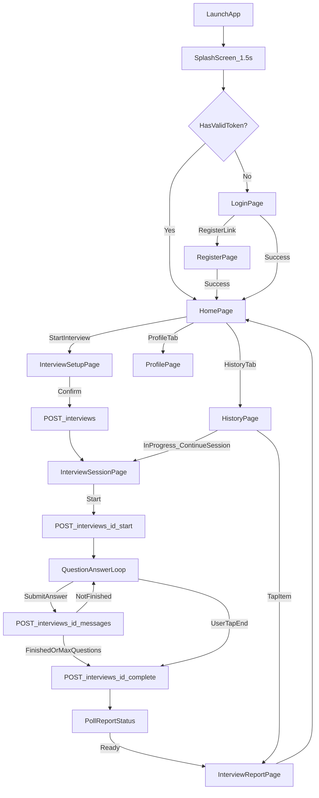

# MockInterview AI — 产品需求文档 (PRD)

> 版本：1.0.0  
> 最后更新：2026-06-12  
> 状态：MVP 核心版  
> 关联文档：[ARCHITECTURE.md](./ARCHITECTURE.md) | [API.md](./API.md) | [DATABASE.md](./DATABASE.md)

---

## 1. 产品概述

### 1.1 产品名称

**MockInterview AI**（中文名：AI 模拟面试助手）

### 1.2 产品定位

面向求职者的移动端 1 对 1 AI 模拟面试工具。用户选择目标岗位与难度后，与 AI 面试官进行文字或语音问答，结束后获得结构化评分报告与改进建议。

### 1.3 目标用户

| 用户画像 | 描述 |
|---------|------|
| 应届生 | 缺乏真实面试经验，需要低成本练习 |
| 1-3 年从业者 | 准备跳槽，需针对特定岗位强化面试表达 |
| 转岗者 | 需要熟悉新岗位常见面试问题 |

### 1.4 核心价值

- **随时可用**：无需预约真人面试官，7×24 小时练习
- **岗位定制**：8 种预置岗位，问题与评分维度与岗位匹配
- **结构化反馈**：5 维评分 + 逐题点评 + 可执行改进建议
- **双模式**：支持文字输入与语音回答（Whisper 转写）

### 1.5 技术栈（固定，不可变更）

| 层级 | 技术 |
|------|------|
| 移动端 | Flutter 3.x（iOS + Android） |
| 后端 | Python 3.11 + FastAPI |
| 数据库 | PostgreSQL 15 |
| 缓存 | Redis 7（Refresh Token 黑名单） |
| AI | OpenAI API（gpt-4o / whisper-1 / tts-1） |

---

## 2. 功能范围

### 2.1 In Scope（MVP 包含）

| 编号 | 功能 | 说明 |
|------|------|------|
| F-01 | 邮箱注册 | 邮箱 + 密码注册 |
| F-02 | 邮箱登录 | 邮箱 + 密码登录，JWT 鉴权 |
| F-03 | Token 刷新 | Access Token 过期自动刷新 |
| F-04 | 退出登录 | 吊销 Refresh Token |
| F-05 | 个人资料 | 查看/编辑昵称、目标岗位 |
| F-06 | 岗位列表 | 从服务端读取 8 个预置岗位 |
| F-07 | 创建面试 | 选择岗位、难度、模式（文字/语音） |
| F-08 | 进行面试 | AI 提问，用户回答，最多 8 轮 |
| F-09 | 语音回答 | 录音 → 上传 → Whisper 转写 → 作为回答提交 |
| F-10 | AI 读题（语音模式） | TTS 朗读 AI 问题 |
| F-11 | 提前结束 | 用户主动结束面试 |
| F-12 | 评分报告 | 5 维评分 + 优缺点 + 逐题反馈 + 总结 |
| F-13 | 历史记录 | 分页查看过往面试列表 |
| F-14 | 报告详情 | 查看单次面试完整报告 |

### 2.2 Out of Scope（MVP 不包含，禁止实现）

- 简历上传与解析
- 订阅付费 / 内购
- 社区 / 题库分享
- 推送通知
- 多语言 UI（界面仅简体中文；岗位名称含中英双语字段）
- 管理员后台
- 社交登录（微信/Apple/Google）
- 视频面试
- 实时 WebSocket 流式对话
- 文件清理策略（TTS/音频上传文件 MVP 阶段不清理，持久化存储）
- API 速率限制与防刷机制（MVP 阶段不实现，后续迭代添加）

---

## 3. 用户角色

| 角色 code | 名称 | 权限 |
|-----------|------|------|
| `candidate` | 求职者 | 注册、登录、创建/进行/查看自己的面试与报告 |

MVP 仅有一种角色，无 RBAC 多角色体系。

---

## 4. 核心用户流程

### 4.1 主流程

### 4.2 注册流程

1. 用户打开 App，无有效 Token → 跳转登录页
2. 点击「注册账号」→ 注册页
3. 填写：邮箱、密码、确认密码、昵称
4. 前端校验通过后调用 `POST /api/v1/auth/register`
5. 注册成功 → 自动登录（返回 tokens）→ 跳转首页

### 4.3 面试流程（详细步骤）

| 步骤 | 用户操作 | 系统行为 | API |
|------|---------|---------|-----|
| 1 | 首页点击「开始模拟面试」 | 跳转面试设置页 | — |
| 2 | 选择岗位（单选） | 展示 8 个预置岗位卡片 | `GET /job-roles` |
| 3 | 选择难度（单选） | 展示初/中/高级三档 | — |
| 4 | 选择模式（单选） | 文字 / 语音 | — |
| 5 | 点击「开始面试」 | 创建会话，跳转面试页 | `POST /interviews` |
| 6 | 面试页加载 | 自动调用开始接口 | `POST /interviews/{id}/start` |
| 7 | 展示 AI 第一个问题 | 语音模式同时 TTS 播放 | — |
| 8 | 用户输入/录音回答 | 文字直接提交；语音先 transcribe 再 submit | `POST /messages` 或 `/transcribe` + `/messages` |
| 9 | 展示下一个问题 | 循环步骤 7-8 | — |
| 10 | 达到 8 题或 AI 判定结束 | 自动调用 complete | `POST /interviews/{id}/complete` |
| 11 | 用户点击「结束面试」 | 若已答 ≥1 题则 complete；0 题则 cancel | `POST /complete` 或 `/cancel` |
| 12 | 展示「报告生成中」 | 每 2 秒轮询 report status | `GET /interviews/{id}/report/status` |
| 13 | 报告就绪 | 跳转报告页 | `GET /interviews/{id}/report` |

### 4.4 语音回答子流程

1. 用户按住「录音」按钮开始录音
2. 松开按钮停止录音，生成本地音频文件（格式：`.m4a` 或 `.webm`，由 Flutter `record` 包决定）
3. 上传至 `POST /api/v1/interviews/{id}/transcribe`（multipart/form-data）
4. 服务端调用 Whisper API 转写，返回 `{ "text": "..." }`
5. 客户端将转写文本展示在输入框，用户可编辑后确认
6. 用户点击「提交回答」→ `POST /api/v1/interviews/{id}/messages`

---

## 5. 功能需求与验收标准

### F-01 / F-02 注册与登录

#### 业务规则

| 规则 ID | 规则描述 |
|---------|---------|
| AUTH-01 | 邮箱必须符合 RFC 5322 格式，最长 255 字符 |
| AUTH-02 | 密码长度 8-64 字符，必须同时包含至少 1 个字母和 1 个数字 |
| AUTH-03 | 注册时 `display_name`（昵称）必填，1-50 字符，允许中文/英文/数字 |
| AUTH-04 | 同一邮箱不可重复注册 |
| AUTH-05 | 密码使用 bcrypt（cost factor=12）哈希存储，明文不得入库 |
| AUTH-06 | 登录成功返回 `accessToken`（有效期 15 分钟）和 `refreshToken`（有效期 7 天） |
| AUTH-07 | 登录失败（邮箱不存在或密码错误）统一返回「邮箱或密码错误」，不泄露邮箱是否存在 |
| AUTH-08 | Access Token 载荷含 `sub`（user_id UUID）、`exp`、`iat` |
| AUTH-09 | Refresh Token 为 64 字节随机 hex，哈希后存 DB |

#### 验收标准

- [ ] 合法邮箱+密码可成功注册，返回 201 与 tokens
- [ ] 重复邮箱注册返回 409，错误码 `40902`
- [ ] 非法邮箱格式返回 400，错误码 `40001`
- [ ] 弱密码返回 400，错误码 `40002`
- [ ] 正确凭据登录返回 200 与 tokens
- [ ] 错误凭据登录返回 401，错误码 `40102`
- [ ] Flutter 登录成功后 tokens 持久化到 secure storage

---

### F-03 / F-04 Token 刷新与退出

#### 业务规则

| 规则 ID | 规则描述 |
|---------|---------|
| AUTH-10 | Access Token 过期时，客户端自动用 Refresh Token 调用 refresh 接口 |
| AUTH-11 | Refresh 成功后返回新的 access + refresh（rotation：旧 refresh 吊销） |
| AUTH-12 | 同一 refresh token 只能使用一次 |
| AUTH-13 | Logout 时吊销当前 refresh token |
| AUTH-14 | 已吊销的 refresh token 不可再次使用 |

#### 验收标准

- [ ] Access 过期后 refresh 成功获得新 token 对
- [ ] 旧 refresh token 再次使用返回 401
- [ ] Logout 后 refresh token 不可用

---

### F-05 个人资料

#### 业务规则

| 规则 ID | 规则描述 |
|---------|---------|
| USER-01 | 用户可查看自己的 email、displayName、targetJobRoleId、avatarUrl、createdAt |
| USER-02 | 可更新字段：`displayName`（1-50 字符）、`targetJobRoleId`（必须为有效 job_role UUID 或 null） |
| USER-03 | email 注册后不可修改 |
| USER-04 | avatarUrl MVP 阶段只读，始终为 null（不上传头像） |

#### 验收标准

- [ ] GET /users/me 返回当前用户完整信息
- [ ] PATCH /users/me 可更新昵称和目标岗位
- [ ] 传入无效 targetJobRoleId 返回 400

---

### F-06 岗位列表

#### 业务规则

| 规则 ID | 规则描述 |
|---------|---------|
| JOB-01 | 返回所有 `is_active=true` 的岗位，按 `sort_order` 升序 |
| JOB-02 | 用户不可创建/编辑/删除岗位 |
| JOB-03 | 岗位数据通过 DB seed 初始化，共 8 条 |

#### 预置岗位（固定，不可增删）

| sort_order | code | name_zh | name_en |
|------------|------|---------|---------|
| 1 | frontend | 前端工程师 | Frontend Engineer |
| 2 | backend | 后端工程师 | Backend Engineer |
| 3 | fullstack | 全栈工程师 | Full Stack Engineer |
| 4 | mobile | 移动端工程师 | Mobile Engineer |
| 5 | product | 产品经理 | Product Manager |
| 6 | data_analyst | 数据分析师 | Data Analyst |
| 7 | algorithm | 算法工程师 | Algorithm Engineer |
| 8 | test_engineer | 测试工程师 | Test Engineer |

#### 验收标准

- [ ] GET /job-roles 返回 8 条岗位，字段含 id/code/nameZh/nameEn/description/sortOrder
- [ ] 面试设置页正确展示 8 个岗位卡片

---

### F-07 创建面试

#### 业务规则

| 规则 ID | 规则描述 |
|---------|---------|
| INT-01 | 创建面试必填：`jobRoleId`（UUID）、`difficulty`（枚举）、`mode`（枚举） |
| INT-02 | `difficulty` 允许值：`junior`（初级）、`mid`（中级）、`senior`（高级） |
| INT-03 | `mode` 允许值：`text`（文字）、`voice`（语音） |
| INT-04 | 创建后会话状态为 `pending`，`question_count=0`，`max_questions=8`，`report_status=pending` |
| INT-05 | 同一用户可同时存在多个 `pending` 或 `in_progress` 会话（不限制） |
| INT-06 | jobRoleId 必须是有效且 is_active 的 job_role |

#### 验收标准

- [ ] POST /interviews 合法参数返回 201 与会话对象
- [ ] 无效 jobRoleId 返回 404
- [ ] 无效 difficulty/mode 返回 400

---

### F-08 进行面试

#### 业务规则

| 规则 ID | 规则描述 |
|---------|---------|
| INT-07 | 只有 `pending` 状态的会话可调用 start |
| INT-08 | start 调用 OpenAI 生成第一个问题，写入 `interview_messages`（role=interviewer, sequence=1） |
| INT-09 | start 后会话状态变为 `in_progress`，`started_at=now()` |
| INT-10 | 用户提交回答：写入 candidate 消息，调用 OpenAI 生成下一题或结束 |
| INT-11 | 每次 AI 生成新问题，`question_count` 加 1 |
| INT-12 | 当 `question_count >= max_questions`（8）时，AI 不再生成新问题，返回 `isFinished=true` |
| INT-13 | 用户回答 content 长度 1-5000 字符 |
| INT-14 | 每条消息 sequence 从 1 递增，同一会话内唯一 |
| INT-15 | interviewer 消息 sequence 为奇数（1,3,5...），candidate 为偶数（2,4,6...） |
| INT-16 | 只有 `in_progress` 状态可提交回答 |
| INT-17 | AI 问题语言：简体中文 |

#### 消息 sequence 规则示例

| sequence | role | 内容 |
|----------|------|------|
| 1 | interviewer | 第 1 个问题 |
| 2 | candidate | 用户第 1 个回答 |
| 3 | interviewer | 第 2 个问题 |
| 4 | candidate | 用户第 2 个回答 |
| ... | ... | ... |

#### 验收标准

- [ ] start 返回第一个 interviewer 消息
- [ ] 提交回答后返回 candidate 消息 + 下一题（或 isFinished=true）
- [ ] 第 8 题回答后 isFinished=true，无 nextQuestion
- [ ] 非 in_progress 状态提交回答返回 409

---

### F-09 / F-10 语音模式

#### 业务规则

| 规则 ID | 规则描述 |
|---------|---------|
| VOICE-01 | transcribe 接口接受 multipart 文件字段名 `audio` |
| VOICE-02 | 支持音频格式：webm, mp3, mp4, m4a, wav；最大 25MB |
| VOICE-03 | 调用 OpenAI whisper-1 模型，language 参数固定 `zh` |
| VOICE-04 | 转写结果返回纯文本，客户端可编辑后再 submit |
| VOICE-05 | 语音模式下，每个 interviewer 问题展示后自动调用 TTS 播放 |
| VOICE-06 | TTS 使用 tts-1 模型，voice=alloy，返回 mp3 音频 URL（服务端生成临时文件或 base64） |
| VOICE-07 | TTS 音频通过 `GET /api/v1/interviews/{id}/messages/{messageId}/tts` 获取 |

#### 验收标准

- [ ] 上传合法音频返回转写文本
- [ ] 超大文件返回 400，错误码 `40003`
- [ ] 语音模式下面试官问题可播放 TTS 音频

---

### F-11 提前结束

#### 业务规则

| 规则 ID | 规则描述 |
|---------|---------|
| INT-18 | complete：将会话状态设为 `completed`，`ended_at=now()` |
| INT-19 | 若 `question_count >= 1`，触发报告生成（report_status → generating） |
| INT-20 | 若 `question_count == 0` 时用户想退出，应调用 cancel 而非 complete |
| INT-21 | cancel：状态设为 `cancelled`，`ended_at=now()`，不生成报告 |
| INT-22 | 只有 `in_progress` 状态可 complete 或 cancel |
| INT-23 | complete 后不可再提交回答 |

#### 验收标准

- [ ] 答过至少 1 题后 complete → status=completed，report_status=generating
- [ ] 0 题 cancel → status=cancelled，无报告
- [ ] completed 后再 submit 返回 409

---

### F-12 评分报告

#### 业务规则

| 规则 ID | 规则描述 |
|---------|---------|
| RPT-01 | 报告在 complete 后异步生成（后台 asyncio task） |
| RPT-02 | 生成过程中 report_status=generating；成功=ready；失败=failed |
| RPT-03 | 报告包含 5 个维度评分，每项 0.00-100.00，保留 2 位小数 |
| RPT-04 | 五维：overallScore, communicationScore, technicalScore, problemSolvingScore, structureScore |
| RPT-05 | strengths：字符串数组，2-5 条
| RPT-06 | weaknesses：字符串数组，2-5 条 |
| RPT-07 | suggestions：字符串数组，3-5 条 |
| RPT-08 | questionFeedback：数组，每项含 sequence/question/answerSummary/score/feedback |
| RPT-09 | summary：200-500 字总结段落 |
| RPT-10 | 每个会话最多 1 份报告（session_id UNIQUE） |
| RPT-11 | 客户端每 2 秒轮询 report/status，最多 60 次（2 分钟超时） |
| RPT-12 | 轮询超时显示「报告生成失败，请稍后在历史记录中查看」 |

#### 验收标准

- [ ] complete 后 report_status 从 pending → generating → ready
- [ ] GET /report 返回完整报告 JSON
- [ ] report 五维分数均在 0-100 范围
- [ ] questionFeedback 条数等于 question_count

---

### F-13 / F-14 历史记录与报告详情

#### 业务规则

| 规则 ID | 规则描述 |
|---------|---------|
| HIST-01 | GET /interviews 分页返回当前用户的会话列表 |
| HIST-02 | 默认按 created_at 降序，page 从 1 开始，pageSize 默认 20，最大 50 |
| HIST-03 | 列表项含：id, jobRoleName, difficulty, mode, status, overallScore（有报告时）, createdAt |
| HIST-04 | 点击 completed 且有报告的条目 → 报告详情页 |
| HIST-05 | cancelled / failed 条目显示状态标签，不可查看报告 |
| HIST-06 | in_progress 条目显示「继续面试」按钮 |
| HIST-07 | App 被杀恢复：启动时若本地存在 in_progress session ID，可直接进入面试页继续（GET /interviews/{id} 获取消息历史） |

#### 验收标准

- [ ] 历史列表正确分页
- [ ] 仅返回当前用户数据
- [ ] 点击已完成条目进入报告页

---

## 6. 页面规格（Flutter 路由）

### 6.1 路由表

| 路由 path | 页面名 | 需登录 | 说明 |
|-----------|--------|--------|------|
| `/splash` | SplashPage | 否 | 启动页，1.5 秒后跳转 |
| `/login` | LoginPage | 否 | 登录 |
| `/register` | RegisterPage | 否 | 注册 |
| `/home` | HomePage | 是 | 首页（底部 Tab：首页/历史/我的） |
| `/interview/setup` | InterviewSetupPage | 是 | 选择岗位/难度/模式 |
| `/interview/session/:id` | InterviewSessionPage | 是 | 面试进行中 |
| `/interview/report/:id` | InterviewReportPage | 是 | 报告详情 |
| `/history` | HistoryPage | 是 | 历史记录（Home Tab 也可嵌入） |
| `/profile` | ProfilePage | 是 | 个人资料 |

### 6.2 页面 UI 要素（最小规格）

#### SplashPage
- App Logo + 产品名
- 1.5 秒后：有 token → `/home`；无 token → `/login`

#### LoginPage
- 字段：邮箱、密码
- 按钮：登录
- 链接：还没有账号？去注册
- 错误：Toast 展示 API 错误 message

#### RegisterPage
- 字段：邮箱、密码、确认密码、昵称
- 按钮：注册
- 前端校验：密码一致、格式合法

#### HomePage
- 顶部：欢迎语「你好，{displayName}」
- 主按钮：「开始模拟面试」→ `/interview/setup`
- 底部 Tab：首页 | 历史 | 我的

#### InterviewSetupPage
- 区块 1：选择岗位（Grid 2 列卡片，选中高亮）
- 区块 2：选择难度（Segmented：初级/中级/高级）
- 区块 3：选择模式（文字 / 语音 两个卡片）
- 底部按钮：「开始面试」（三项均选中才可点击）

#### InterviewSessionPage
- 顶部：进度「第 {n}/{max} 题」+ 结束按钮
- 中部：聊天气泡列表（interviewer 左，candidate 右）
- 底部（文字模式）：TextField + 发送按钮
- 底部（语音模式）：按住录音按钮 + 转写预览 + 提交按钮
- 结束确认 Dialog：「确定结束面试吗？」

#### InterviewReportPage
- 顶部：综合得分（大号数字 + 环形进度）
- 五维雷达图或条形图
- 优点列表、不足列表、建议列表
- 逐题反馈折叠面板
- 底部：「返回首页」

#### HistoryPage
- 列表：岗位名 | 难度 | 日期 | 分数/状态
- 空状态：「暂无面试记录」

#### ProfilePage
- 展示：邮箱（只读）、昵称（可编辑）、目标岗位（下拉）
- 按钮：保存、退出登录

---

## 7. 非功能需求

| 编号 | 类别 | 要求 |
|------|------|------|
| NFR-01 | 性能 | 非 OpenAI 接口 P95 响应 < 2s |
| NFR-02 | 性能 | OpenAI 调用超时 60s，失败重试 2 次（间隔 1s） |
| NFR-03 | 兼容 | iOS 14+ / Android API 26+ (8.0) |
| NFR-04 | 安全 | 全链路 HTTPS（生产）；密码 bcrypt；JWT HS256 |
| NFR-05 | 安全 | 用户只能访问自己的 session/report |
| NFR-06 | 配置 | 敏感信息走环境变量，不得硬编码 |
| NFR-07 | 日志 | 后端结构化 JSON 日志，含 request_id；不记录密码和 token 明文 |
| NFR-08 | 可用性 | 后端健康检查 `GET /health` 返回 200 |
| NFR-09 | 数据 | 软删除用户（deleted_at），MVP 不实现物理删除 |

---

## 8. 术语表

| 术语 | 定义 |
|------|------|
| 会话 (Session) | 一次完整的模拟面试，对应 `interview_sessions` 表一行 |
| 回合 (Round) | 一次「AI 提问 + 用户回答」，question_count 计 AI 提问次数 |
| 报告 (Report) | 面试完成后的 AI 评分结果，对应 `interview_reports` 表 |
| 岗位 (Job Role) | 预置的面试目标职位，共 8 种 |

---

## 9. 修订记录

| 版本 | 日期 | 变更 |
|------|------|------|
| 1.0.0 | 2026-06-12 | 初始 MVP PRD |
