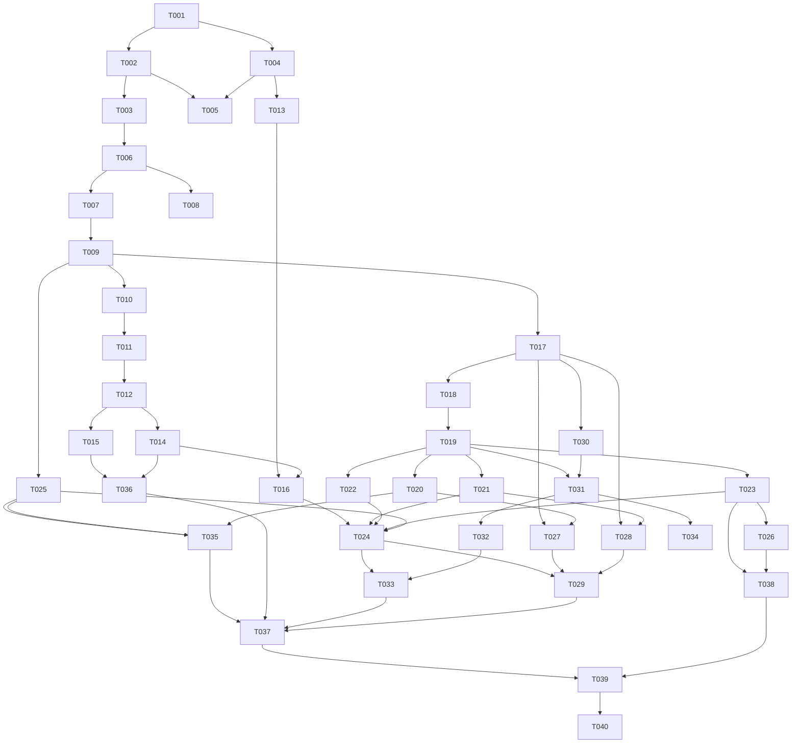

# MockInterview AI — 开发任务清单

> 版本：1.0.0  
> 最后更新：2026-06-12  
> 任务粒度：每项 ≤ 4 小时（半天）  
> 关联文档：[CLAUDE_INSTRUCTIONS.md](./CLAUDE_INSTRUCTIONS.md) | [API.md](./API.md) | [DATABASE.md](./DATABASE.md)

---

## 1. 使用说明

### 1.1 任务字段说明

| 字段 | 说明 |
|------|------|
| ID | 任务编号，格式 `T{阶段}{序号}`，如 T001 |
| 标题 | 任务简述 |
| 依赖 | 必须先完成的任务 ID |
| 产出 | 需创建/修改的文件路径 |
| 验收标准 | 可测试的完成条件（全部满足才算完成） |
| 参考 | 关联文档章节 |

### 1.2 执行规则

1. **严格按 ID 顺序执行**，不得跳过
2. 一次只做一个任务
3. 完成后自检验收标准，再开始下一项
4. 不得自行添加 PRD 外的功能
5. Git 分支命名：`feature/T{id}-{slug}`

---

## 2. 任务总览

| 阶段 | 任务数 | ID 范围 |
|------|--------|---------|
| P0 基础设施 | 5 | T001-T005 |
| P1 数据层 | 4 | T006-T009 |
| P2 认证 | 4 | T010-T013 |
| P3 岗位与用户 | 3 | T014-T016 |
| P4 面试核心 | 10 | T017-T026 |
| P5 语音 | 3 | T027-T029 |
| P6 报告 | 5 | T030-T034 |
| P7 历史与收尾 | 4 | T035-T038 |
| P8 文档与 QA | 2 | T039-T040 |

**合计：40 项任务**

---

## 3. 详细任务列表

---

### P0 基础设施

#### T001 — 创建 Monorepo 根目录与 docker-compose

| 项 | 内容 |
|----|------|
| **依赖** | 无 |
| **产出** | `docker-compose.yml`, `README.md`, `.gitignore` |
| **参考** | ARCHITECTURE §9 |

**实施内容：**
- 创建 `docker-compose.yml`：postgres:15, redis:7, backend 服务
- 创建 `.gitignore`：Python, Flutter, .env, uploads/
- 创建 `README.md`：项目简介、docker-compose 启动命令

**验收标准：**
- [ ] `docker-compose config` 无语法错误
- [ ] postgres 端口 5432，redis 6379，backend 8000
- [ ] `.gitignore` 包含 `.env`, `__pycache__`, `.dart_tool`, `uploads/`

---

#### T002 — 后端 FastAPI 脚手架

| 项 | 内容 |
|----|------|
| **依赖** | T001 |
| **产出** | `backend/requirements.txt`, `backend/Dockerfile`, `backend/app/main.py`, `backend/app/core/config.py`, `backend/.env.example` |
| **参考** | ARCHITECTURE §2, §9.2 |

**实施内容：**
- `requirements.txt`：fastapi, uvicorn, sqlalchemy[asyncio], asyncpg, alembic, pydantic-settings, python-jose, passlib[bcrypt], httpx, openai, redis, python-multipart
- `main.py`：FastAPI app, CORS, `/health` 端点, `/api/v1` router 挂载点
- `config.py`：Settings 类读取环境变量（见 ARCHITECTURE §9.2）
- `Dockerfile`：python:3.11-slim, 安装依赖, uvicorn 启动

**验收标准：**
- [ ] `docker-compose up backend` 启动成功
- [ ] `GET /health` 返回 `{"status":"ok","timestamp":"..."}`
- [ ] `.env.example` 包含全部环境变量

---

#### T003 — Alembic 初始化

| 项 | 内容 |
|----|------|
| **依赖** | T002 |
| **产出** | `backend/alembic/`, `backend/app/db/base.py`, `backend/app/db/session.py` |
| **参考** | DATABASE §6 |

**实施内容：**
- 初始化 alembic，`env.py` 使用 async SQLAlchemy
- `session.py`：async session factory
- `base.py`：DeclarativeBase

**验收标准：**
- [ ] `alembic upgrade head` 可执行（尚无 migration 时不报错）
- [ ] backend 启动时可连接 PostgreSQL

---

#### T004 — Flutter 项目脚手架

| 项 | 内容 |
|----|------|
| **依赖** | T001 |
| **产出** | `mobile/` 完整 Flutter 项目 |
| **参考** | ARCHITECTURE §2, PRD §6 |

**实施内容：**
- `flutter create mobile`
- 添加依赖：flutter_bloc, equatable, dio, flutter_secure_storage, go_router, get_it, flutter_dotenv, freezed_annotation, json_annotation, record, audioplayers, intl
- 添加 dev 依赖：build_runner, freezed, json_serializable
- 创建目录结构：`lib/app/`, `lib/core/`, `lib/features/`, `lib/shared/`
- `mobile/.env.example`：`API_BASE_URL=http://10.0.2.2:8000/api/v1`

**验收标准：**
- [ ] `flutter analyze` 无 error
- [ ] 目录结构与 ARCHITECTURE §2 一致
- [ ] App 可编译运行（空白 MaterialApp）

---

#### T005 — 共享常量与异常类

| 项 | 内容 |
|----|------|
| **依赖** | T002, T004 |
| **产出** | `backend/app/core/exceptions.py`, `backend/app/core/logging.py`, `mobile/lib/core/constants/api_constants.dart`, `mobile/lib/core/network/api_exception.dart` |
| **参考** | API §1.5, CODING_STANDARD |

**实施内容：**
- 后端：`AppException(code, message, details)`, 全局 exception handler 返回 API 统一错误格式
- 后端：JSON 结构化 logging
- 移动端：`ApiConstants` 含 baseUrl, timeout
- 移动端：`ApiException` 含 code, message, details

**验收标准：**
- [ ] 后端抛 AppException 返回正确 JSON 错误结构
- [ ] 移动端 ApiException 可从 Dio 错误解析

---

### P1 数据层

#### T006 — 数据库 Migration 001-003

| 项 | 内容 |
|----|------|
| **依赖** | T003 |
| **产出** | `backend/alembic/versions/001_create_job_roles.py`, `002_create_users.py`, `003_create_refresh_tokens.py` |
| **参考** | DATABASE §5 DDL |

**验收标准：**
- [x] `alembic upgrade head` 创建 job_roles, users, refresh_tokens 三张表
- [x] 所有 CHECK/UNIQUE/FK 约束与 DATABASE.md 一致

---

#### T007 — 数据库 Migration 004-006

| 项 | 内容 |
|----|------|
| **依赖** | T006 |
| **产出** | `004_create_interview_sessions.py`, `005_create_interview_messages.py`, `006_create_interview_reports.py` |
| **参考** | DATABASE §5 |

**验收标准：**
- [x] 6 张表全部创建成功
- [x] interview_messages 有 UNIQUE(session_id, sequence)
- [x] interview_reports 有 UNIQUE(session_id)

---

#### T008 — 种子数据 Migration 007

| 项 | 内容 |
|----|------|
| **依赖** | T006 |
| **产出** | `007_seed_job_roles.py` |
| **参考** | DATABASE §7 |

**验收标准：**
- [x] `alembic upgrade head` 后 job_roles 表有 8 条记录
- [x] UUID 与 DATABASE.md §7.1 一致

---

#### T009 — SQLAlchemy Models 与 Pydantic Schemas

| 项 | 内容 |
|----|------|
| **依赖** | T007 |
| **产出** | `backend/app/models/*.py`, `backend/app/schemas/*.py` |
| **参考** | DATABASE §4, API §2 |

**实施内容：**
- 6 个 SQLAlchemy Model，字段与 DATABASE.md 完全一致
- Pydantic schemas：auth, user, job_role, interview, report
- 所有 Response schema 使用 camelCase alias（`model_config = ConfigDict(populate_by_name=True, alias_generator=to_camel)`）

**验收标准：**
- [x] Model 字段名、类型、关系与 DATABASE.md 一致
- [x] Schema 字段与 API.md §2 一致
- [x] `from_attributes = True` 配置正确

---

### P2 认证

#### T010 — 密码哈希与 JWT 工具

| 项 | 内容 |
|----|------|
| **依赖** | T009 |
| **产出** | `backend/app/core/security.py` |
| **参考** | PRD AUTH-01~09, ARCHITECTURE §8.1 |

**实施内容：**
- `hash_password()`, `verify_password()` — bcrypt cost=12
- `create_access_token(user_id)` — 15min
- `create_refresh_token()` — 64 bytes hex
- `hash_refresh_token()` — SHA-256
- `decode_access_token()` — 验证 JWT

**验收标准：**
- [ ] 密码哈希/验证正确
- [ ] JWT 解码可获取 user_id
- [ ] refresh token 为 64 字符 hex

---

#### T011 — AuthService 实现

| 项 | 内容 |
|----|------|
| **依赖** | T010 |
| **产出** | `backend/app/services/auth_service.py` |
| **参考** | PRD F-01~F-04, API §3.1-3.4 |

**实施内容：**
- `register(email, password, display_name)` → user + tokens
- `login(email, password)` → user + tokens
- `refresh(refresh_token)` → new tokens (rotation, revoke old)
- `logout(refresh_token)` → revoke

**验收标准：**
- [ ] 重复邮箱注册抛 40902
- [ ] 弱密码抛 40002
- [ ] 错误登录抛 40102
- [ ] refresh rotation 正确

---

#### T012 — Auth API Routes

| 项 | 内容 |
|----|------|
| **依赖** | T011 |
| **产出** | `backend/app/api/v1/auth.py`, `backend/app/api/deps.py` |
| **参考** | API §3.1-3.4 |

**实施内容：**
- 4 个 auth 端点
- `deps.py`：`get_current_user` 依赖（从 JWT 解析 user）
- 注册到 `router.py`

**验收标准：**
- [ ] 4 个端点响应格式与 API.md 一致
- [ ] `get_current_user` 无效 token 返回 40101

---

#### T013 — Flutter 认证模块

| 项 | 内容 |
|----|------|
| **依赖** | T004, T005 |
| **产出** | `mobile/lib/features/auth/` 全部文件, `mobile/lib/core/network/dio_client.dart`, `mobile/lib/core/network/auth_interceptor.dart`, `mobile/lib/core/storage/secure_storage.dart` |
| **参考** | PRD §6.2 Login/Register, API §3.1-3.4 |

**实施内容：**
- SecureStorage 存取 tokens
- DioClient + AuthInterceptor（401 自动 refresh）
- AuthRepository：register, login, logout, refresh
- AuthBloc：LoginEvent, RegisterEvent, LogoutEvent
- LoginPage, RegisterPage UI（PRD §6.2 规格）

**验收标准：**
- [ ] 可注册、登录、token 持久化
- [ ] 401 时自动 refresh 并重试
- [ ] 表单校验：邮箱格式、密码规则、密码一致

---

### P3 岗位与用户

#### T014 — Job Roles API

| 项 | 内容 |
|----|------|
| **依赖** | T012 |
| **产出** | `backend/app/api/v1/job_roles.py`, `backend/app/services/` (query in route or simple service) |
| **参考** | API §3.7, PRD JOB-01~03 |

**验收标准：**
- [ ] GET /job-roles 返回 8 条，按 sortOrder 升序
- [ ] 仅返回 is_active=true

---

#### T015 — Users API

| 项 | 内容 |
|----|------|
| **依赖** | T012 |
| **产出** | `backend/app/services/user_service.py`, `backend/app/api/v1/users.py` |
| **参考** | API §3.5-3.6, PRD USER-01~04 |

**验收标准：**
- [ ] GET /users/me 返回 UserResponse
- [ ] PATCH /users/me 可更新 displayName, targetJobRoleId
- [ ] 无效 targetJobRoleId 返回 40402

---

#### T016 — Flutter 首页与面试设置页

| 项 | 内容 |
|----|------|
| **依赖** | T013, T014 |
| **产出** | `mobile/lib/features/home/`, `mobile/lib/features/interview/presentation/setup/`, `mobile/lib/app/router.dart` |
| **参考** | PRD §6.1-6.2 Home/Setup |

**实施内容：**
- GoRouter 路由配置（PRD §6.1 全部路由）
- SplashPage：1.5s 检查 token
- HomePage：欢迎语 + 开始按钮 + BottomNavigationBar
- InterviewSetupPage：岗位 Grid + 难度 Segmented + 模式选择 + 创建会话

**验收标准：**
- [ ] 未登录跳转 /login
- [ ] 设置页展示 8 个岗位
- [ ] 三项全选后「开始面试」按钮可点击，点击后跳转至 session 页（POST /interviews 由 T020 实现）

---

### P4 面试核心

#### T017 — OpenAI Service 基础

| 项 | 内容 |
|----|------|
| **依赖** | T009 |
| **产出** | `backend/app/services/openai_service.py`, `backend/app/prompts/*.txt` (4 个文件) |
| **参考** | ARCHITECTURE §5, §6 |

**实施内容：**
- 复制 ARCHITECTURE §6 的 4 个 prompt 文件 verbatim
- OpenAIService 基础：client 初始化, retry 逻辑
- `_load_prompt()`, `_format_conversation_history()`

**验收标准：**
- [ ] 4 个 prompt 文件内容与 ARCHITECTURE §6 完全一致
- [ ] retry 2 次后抛 50201

---

#### T018 — OpenAI 首题与下一题生成

| 项 | 内容 |
|----|------|
| **依赖** | T017 |
| **产出** | `openai_service.py` 扩展 |
| **参考** | ARCHITECTURE §7.1 |

**实施内容：**
- `generate_first_question(job_role_name, difficulty, max_questions)`
- `generate_next_question(...)` → (text, is_finished)
- difficulty 映射 difficulty_label

**验收标准：**
- [ ] 首题返回非空字符串
- [ ] 下一题在 question_count >= max 时 is_finished=True
- [ ] LLM 输出 `[INTERVIEW_COMPLETE]` 时 is_finished=True

---

#### T019 — InterviewService 状态机

| 项 | 内容 |
|----|------|
| **依赖** | T018 |
| **产出** | `backend/app/services/interview_service.py` |
| **参考** | ARCHITECTURE §3, PRD INT-01~23 |

**实施内容：**
- `create_session(user_id, job_role_id, difficulty, mode)`
- `start_session(session_id, user_id)` — pending → in_progress
- `submit_answer(session_id, user_id, content)` — 存 candidate + 生成下一题
- `complete_session(session_id, user_id)` — → completed
- `cancel_session(session_id, user_id)` — → cancelled
- 所有状态校验按 PRD 规则

**验收标准：**
- [ ] 状态转换与 ARCHITECTURE §3.1 一致
- [ ] sequence 规则：interviewer 奇数, candidate 偶数
- [ ] 非法状态操作抛 40901/40903

---

#### T020 — Interview API: 创建/列表/详情

| 项 | 内容 |
|----|------|
| **依赖** | T019 |
| **产出** | `backend/app/api/v1/interviews.py` (部分) |
| **参考** | API §3.8-3.10 |

**验收标准：**
- [ ] POST /interviews 返回 201
- [ ] GET /interviews 分页正确，仅返回当前用户
- [ ] GET /interviews/{id} 含 messages
- [ ] 非本人访问返回 40301

---

#### T021 — Interview API: start

| 项 | 内容 |
|----|------|
| **依赖** | T019 |
| **产出** | `interviews.py` 扩展 |
| **参考** | API §3.11 |

**验收标准：**
- [ ] POST /start 返回 session + question
- [ ] pending 以外状态返回 40903
- [ ] question_count=1, status=in_progress

---

#### T022 — Interview API: messages

| 项 | 内容 |
|----|------|
| **依赖** | T019 |
| **产出** | `interviews.py` 扩展 |
| **参考** | API §3.12 |

**验收标准：**
- [ ] POST /messages 返回 answer + nextQuestion + isFinished + questionCount
- [ ] content 空或 >5000 返回 40001
- [ ] 第 8 题后 isFinished=true, nextQuestion=null

---

#### T023 — Interview API: complete/cancel

| 项 | 内容 |
|----|------|
| **依赖** | T019 |
| **产出** | `interviews.py` 扩展 |
| **参考** | API §3.13-3.14 |

**验收标准：**
- [ ] complete：question_count>=1 → completed + report_status=generating
- [ ] complete：question_count==0 → 40901
- [ ] cancel：0 题 → cancelled
- [ ] cancel：有答题 → 40901

---

#### T024 — Flutter 面试会话页（文字模式）

| 项 | 内容 |
|----|------|
| **依赖** | T016, T021, T022, T023 |
| **产出** | `mobile/lib/features/interview/presentation/session/` |
| **参考** | PRD §6.2 InterviewSessionPage |

**实施内容：**
- InterviewBloc：StartInterview, SubmitAnswer, CompleteInterview, CancelInterview
- 聊天气泡 UI（interviewer 左, candidate 右）
- 进度显示「第 n/8 题」
- 文字输入 + 发送
- 进入页面自动调用 start
- isFinished 时自动 complete

**验收标准：**
- [ ] 文字模式完整 Q&A 流程可跑通
- [ ] 结束确认 Dialog
- [ ] 完成后跳转报告轮询页

---

#### T025 — Flutter Interview Repository 与 Models

| 项 | 内容 |
|----|------|
| **依赖** | T013, T009 |
| **产出** | `mobile/lib/features/interview/data/`, `mobile/lib/shared/models/` |
| **参考** | API §2 |

**实施内容：**
- Freezed models：InterviewSession, Message, JobRole 等
- InterviewRepository：全部 interview API 调用

**验收标准：**
- [ ] Models 字段与 API §2 camelCase 一致
- [ ] JSON 序列化/反序列化正确

---

#### T026 — 后端 Interview 单元测试

| 项 | 内容 |
|----|------|
| **依赖** | T023 |
| **产出** | `backend/tests/test_interview_service.py`, `backend/tests/conftest.py` |
| **参考** | CODING_STANDARD |

**验收标准：**
- [ ] 测试状态机转换（pending→in_progress→completed）
- [ ] 测试非法状态抛异常
- [ ] `pytest` 全部通过

---

### P5 语音

#### T027 — Whisper 转写 API

| 项 | 内容 |
|----|------|
| **依赖** | T017, T020 |
| **产出** | `openai_service.py` transcribe, `interviews.py` transcribe endpoint |
| **参考** | API §3.15, PRD VOICE-01~04 |

**验收标准：**
- [ ] POST /transcribe 接受 multipart audio
- [ ] 返回 text + audioUrl
- [ ] >25MB 返回 40003
- [ ] 不支持格式返回 40004

---

#### T028 — TTS 音频 API

| 项 | 内容 |
|----|------|
| **依赖** | T017, T021 |
| **产出** | `openai_service.py` synthesize, TTS endpoint |
| **参考** | API §3.18, PRD VOICE-05~07 |

**验收标准：**
- [ ] GET /messages/{messageId}/tts 返回 audio/mpeg
- [ ] 仅 voice 模式 + interviewer 消息可用
- [ ] TTS 文件缓存至 uploads/tts/

---

#### T029 — Flutter 语音模式 UI

| 项 | 内容 |
|----|------|
| **依赖** | T024, T027, T028 |
| **产出** | `mobile/lib/features/interview/presentation/session/voice/` |
| **参考** | PRD §4.4, §6.2 |

**实施内容：**
- 录音按钮（record 包）
- 上传 transcribe → 展示可编辑文本 → submit
- interviewer 问题 TTS 播放（audioplayers）

**验收标准：**
- [ ] 语音模式录音→转写→提交流程可跑通
- [ ] AI 问题自动播放 TTS

---

### P6 报告

#### T030 — OpenAI 报告生成

| 项 | 内容 |
|----|------|
| **依赖** | T017 |
| **产出** | `openai_service.py` generate_report |
| **参考** | ARCHITECTURE §6.4, §7.1 |

**验收标准：**
- [ ] 返回 dict 含全部 ReportResponse 字段
- [ ] JSON 解析失败抛异常
- [ ] 分数范围校验 0-100

---

#### T031 — ReportService 异步生成

| 项 | 内容 |
|----|------|
| **依赖** | T030, T019 |
| **产出** | `backend/app/services/report_service.py` |
| **参考** | ARCHITECTURE §10, PRD RPT-01~12 |

**实施内容：**
- `trigger_report_generation(session_id)` — asyncio.create_task
- `_generate_report_task(session_id)` — 完整流程
- 成功 → report_status=ready; 失败 → failed

**验收标准：**
- [ ] complete 后 report_status: pending→generating→ready
- [ ] interview_reports 表写入正确
- [ ] 失败时 report_status=failed

---

#### T032 — Report API

| 项 | 内容 |
|----|------|
| **依赖** | T031 |
| **产出** | `interviews.py` report endpoints |
| **参考** | API §3.16-3.17 |

**验收标准：**
- [ ] GET /report/status 返回 reportStatus
- [ ] GET /report 在 ready 时返回 ReportResponse
- [ ] 非 ready 时 GET /report 返回 40404

---

#### T033 — Flutter 报告页与轮询

| 项 | 内容 |
|----|------|
| **依赖** | T024, T032 |
| **产出** | `mobile/lib/features/report/` |
| **参考** | PRD §6.2 InterviewReportPage, RPT-11 |

**实施内容：**
- 报告生成中 Loading 页，每 2 秒轮询 status
- 最多 60 次（2 分钟）
- ReportPage：综合分 + 五维分数 + 列表 + 逐题反馈

**验收标准：**
- [ ] 面试完成后自动轮询并展示报告
- [ ] 超时显示失败提示
- [ ] 报告 UI 展示全部字段

---

#### T034 — Report 单元测试

| 项 | 内容 |
|----|------|
| **依赖** | T031 |
| **产出** | `backend/tests/test_report_service.py` |
| **参考** | CODING_STANDARD |

**验收标准：**
- [ ] mock OpenAI 返回固定 JSON
- [ ] 验证 report 写入 DB
- [ ] 验证 report_status 流转

---

### P7 历史与收尾

#### T035 — Flutter 历史记录页

| 项 | 内容 |
|----|------|
| **依赖** | T025, T020 |
| **产出** | `mobile/lib/features/history/` |
| **参考** | PRD §6.2 HistoryPage, HIST-01~06 |

**验收标准：**
- [ ] 列表展示岗位、难度、日期、分数/状态
- [ ] completed+ready 可点击进入报告
- [ ] in_progress 显示「继续面试」
- [ ] 空状态文案

---

#### T036 — Flutter 个人资料页

| 项 | 内容 |
|----|------|
| **依赖** | T015, T014 |
| **产出** | `mobile/lib/features/profile/` |
| **参考** | PRD §6.2 ProfilePage |

**验收标准：**
- [ ] 展示邮箱（只读）
- [ ] 可编辑昵称、目标岗位
- [ ] 保存调用 PATCH /users/me
- [ ] 退出登录清除 token 跳转 /login

---

#### T037 — Flutter App 整合与主题

| 项 | 内容 |
|----|------|
| **依赖** | T035, T036, T033, T029 |
| **产出** | `mobile/lib/app/app.dart`, `mobile/lib/app/theme.dart`, `mobile/lib/app/di.dart`, `mobile/lib/main.dart` |
| **参考** | PRD §6 |

**实施内容：**
- 统一主题色（Primary: #2563EB, 背景: #F8FAFC）
- GetIt 注册全部依赖
- GoRouter 完整路由 + 认证 redirect
- main.dart 加载 dotenv

**验收标准：**
- [ ] 全部页面可导航
- [ ] 主题统一
- [ ] DI 正常工作

---

#### T038 — 后端 Auth 集成测试

| 项 | 内容 |
|----|------|
| **依赖** | T026 |
| **产出** | `backend/tests/test_auth_api.py`, `backend/tests/test_interview_api.py` |
| **参考** | API §3.1-3.14 |

**验收标准：**
- [ ] 注册→登录→refresh→logout 流程测试通过
- [ ] 创建→start→messages→complete 流程测试通过（mock OpenAI）

---

### P8 文档与 QA

#### T039 — README 与运行文档

| 项 | 内容 |
|----|------|
| **依赖** | T037, T038 |
| **产出** | `README.md` 更新 |
| **参考** | ARCHITECTURE §9 |

**实施内容：**
- 环境准备（Docker, Flutter, OpenAI Key）
- 启动步骤：docker-compose up, alembic upgrade, flutter run
- 环境变量说明
- 常见问题

**验收标准：**
- [ ] 按 README 步骤可从零启动项目
- [ ] 包含 OpenAI API Key 配置说明

---

#### T040 — E2E 冒烟测试清单

| 项 | 内容 |
|----|------|
| **依赖** | T039 |
| **产出** | `docs/E2E_CHECKLIST.md` |
| **参考** | PRD 全部验收标准 |

**实施内容：**
- 编写可手工执行的 E2E 检查清单（注册→登录→选岗→文字面试 3 题→结束→查看报告→历史→退出）
- 语音模式冒烟项
- 错误场景项（弱密码、重复注册、401 refresh）

**验收标准：**
- [ ] 清单覆盖 PRD 所有核心验收标准
- [ ] 每项有预期结果

---

## 4. 依赖关系图

---

## 5. 修订记录

| 版本 | 日期 | 变更 |
|------|------|------|
| 1.0.0 | 2026-06-12 | 初始 40 项任务 |
